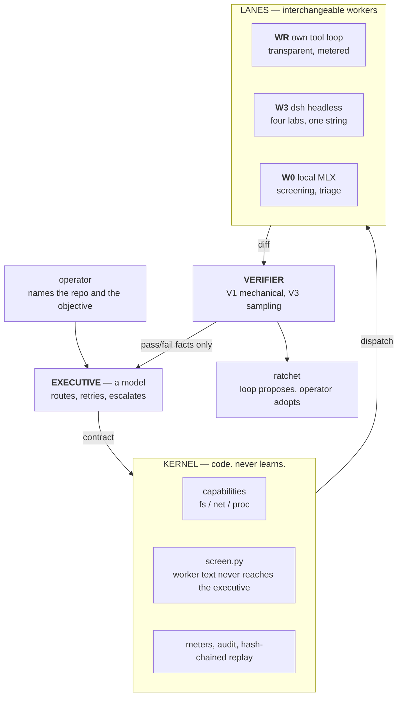

# Chingis

**An adaptive harness: a research platform for verifier-bounded recursive self-improvement.**

Most agent harnesses are rigid code wrapped around a smart model. Chingis inverts that.
The orchestration layer — routing, context assembly, retry, escalation — is itself a
model making live decisions. What stays hard-coded is only the part that must never
learn: permissions, containment, and the verifier that decides whether work was good.

The bet is narrow and falsifiable: **an adaptive harness beats a fixed one**, and a system
may be allowed to improve itself exactly as far as something it does not control can
measure.

> This documents a research platform, not a product. It has produced one pre-registered
> experimental result so far, and that result was a **failure**. It is reported below in
> the same detail as anything that worked, because a self-improving system whose owner
> grades its own homework is not a research platform — it is a press release.

---

## How it works



**The executive is a model.** It receives a ledger and an event and emits a schema-valid
decision: dispatch to a lane, retry, escalate, halt. Routing is judgment informed by
*facts* — lane economics, quota windows, refusal tendencies — rather than hard-coded
rules, so when a provider changes its pricing you update a fact instead of hunting down a
branch.

**The kernel is law.** Capabilities are minted per contract and checked by code the model
cannot reach. Every worker runs in a disposable git worktree: the worktree is the blast
radius, the diff is the artifact. Every event is hash-chained, so any task replays
byte-deterministically.

**Worker text never reaches the executive.** The named attack surface here is not prompt
injection against a worker — it is **orchestration hijack**: injected text that persuades
the *orchestrator*. `kernel/screen.py` sits at the event boundary and reduces worker
output to shape (`worker output: 294 chars, 6 lines, 4 non-blank`) plus mechanical
pass/fail facts. Instruction-shaped content is quoted inert inside a tag the worker cannot
close from inside. Three layers — structural, heuristic, semantic — and the first holds
when the other two miss.

**Lanes are interchangeable.** The same contract runs on any lane unmodified.

| Lane | What it is | Transparency |
|---|---|---|
| `WR` | Chingis' own kernel-gated tool loop | Every step in the audit log |
| `W3` | [DeepSeek Harness](https://github.com/deepseek-ai/deepseek-harness), driven headless | Opaque inner shell; judged by its diff |
| `W0` | Local MLX | Summarize, triage, screen |

`W3` reaches z.ai, Anthropic, xAI, and DeepSeek by changing one string in the contract.
Claude Code lanes existed until 2026-08-17 and were removed: they drove a third-party CLI
whose inner shell could be neither inspected nor pinned, and whose model turned out to be
a vendor mapping rather than a choice — it had been labelled `glm-5.2` for months while
actually serving `glm-4.7`.

---

## The part that makes it a research platform

Three mechanisms, each of which exists to make it *harder* for the system to flatter
itself.

### 1. Experiments are pre-registered and the thresholds are frozen

Before an experiment runs, its decision rule is written down and frozen. Afterwards every
deviation goes into an append-only `DEVIATIONS.md` — what broke, why, and what changed.
The pre-registration is never edited to match the outcome.

### 2. Gates refuse in code, not in prose

A design document saying "the loop may not modify the kernel" is a wish. These execute:

```
$ python -c "from loop.ws_gate import require_ws_gate; require_ws_gate()"
WsGateClosed: The WS (sovereign) lane is closed. Unmet conditions:
  - B0 did not FAIL: B0 returned FAIL on 2026-08-17 ...
  - a reviewer exists that V1 cannot stand in for: verification is V1+V3. V1 is
    mechanical, and a self-authored tool passes the tests it ships with ...
  - a successor pre-registration is signed: ...
```

That gate reads no environment variable and takes no `force=` argument — a test asserts
their absence over the AST, because a gate with a bypass is not a gate. A proposal that
would write inside the protected set is refused at staging and **counted**: one attempt is
noise, a pattern of them is a finding about the executive.

The loop may propose. Only the operator may adopt.

### 3. Containment is measured, not asserted

Claims about containment get probed with a real model told to break them. That is how the
current numbers were obtained — and how a hole was found.

`net:none` appeared on every contract and was **enforced by nothing**. `check_net()` was
dead code; a contract declaring no network reached the public internet with `HTTP:200` and
no denial. It is now enforced below the command via `sandbox-exec`, so it holds against
`curl`, `python`, `nc`, or anything else a worker reaches for, and **fails closed** where
the platform cannot enforce it. The known limit — the grant is all-or-nothing, because the
sandbox filters by operation rather than by host — is asserted by a test rather than
buried in a comment.

---

## Results

### B0 — cross-fleet verification: **FAIL**

The founding question: *do two labs' models catch each other's defects better than a model
catches its own?* If yes, cross-fleet review becomes a verification tier. Pre-registered
bar: **≥15 pp**.

| | Catch rate | 95% CI (Wilson) | n |
|---|---|---|---|
| Self-review | 80.0% | 49.0–94.3% | 10 |
| Cross-review | 90.0% | 59.6–98.2% | 10 |
| **Margin** | **+10.0 pp** | McNemar p = **1.0000** | — |

**Verdict: FAIL.** The margin missed the bar, was statistically indistinguishable from
zero, and the two directions **disagreed in sign** (−20 pp one way, +40 pp the other). The
pre-registered consequence was paid: the cross-fleet verification tier was **dropped from
the design**, and the module that would implement it now refuses to wire itself.

That failure is the most useful thing this project has produced. It also left the live
open question, because a sign disagreement is not noise around one effect — it is the
signature of a factor the design did not model. Regrouping B0's own reviews by *who
reviewed* rather than *whether the review crossed lineage* reproduces every published
figure and splits the data three times as sharply. That is post-hoc at n=10, so it is
filed as a hypothesis with a pre-registered replication drafted and **unrun**.

### B1H — harness contrast: no signal, and the ceiling is the finding

Three architecturally unrelated harnesses, one model, one verifier, five repair tasks.
Every arm scored 5/5. A benchmark on which everyone scores 100% cannot rank anything, and
establishing that was its only useful output.

More interesting: the apparatus produced **two false results before a true one**. A worker
that runs the tests generates `.pyc` files; `git add -A` swept them into the diff as
binary hunks; `git apply` rejected the whole patch — and one harness scored 1/5 while
having actually solved every task. Then provider throttling returned 0/3 for a lane that,
on retry, returned 3/3. Both are recorded, because a benchmark that hides its own repairs
is worth nothing.

---

## Status

| Component | State |
|---|---|
| Kernel, replay, capabilities | done — byte-deterministic replay green |
| Injection containment | done — raw worker text cannot reach the executive |
| Network containment | done — enforced 2026-08-17; previously decorative |
| Lane adapters | `WR` and `W3` live; `W0` needs a local server |
| Executive, routing reflexes | done — model-authored, TTL'd, provenance-checked |
| Verification | V1 + V3 live. **V2 dropped by experiment.** |
| Proposal ratchet | done — loop proposes, operator adopts |
| Sovereign lane (self-authored tools) | **gated shut**, refuses in code |
| Self-improvement cycles | scaffolded, unexercised |

**190 tests pass.**

---

## What this is not

It is not AGI and does not claim to be on a path to it. It produces *evidence* —
pre-registered, deviation-logged, falsifiable evidence — about whether verifier-bounded
self-improvement compounds. The direction is the goal, the ladder is the instrument, and
the ratchet is why a human stays sovereign over every change that persists.

The one experiment that has reported so far said **no**. That is what the instrument is
for.

---

## Running it

```bash
uv sync
uv run ./cli.py health                          # what is reachable right now
uv run ./cli.py submit "objective" --repo PATH  # run one task
uv run ./cli.py status                          # decisions logged, chain integrity
uv run pytest -q
```

The operator names the repo; the executive names the lane. A model that could choose its
own worktree root would be choosing its own containment.

## License

MIT
